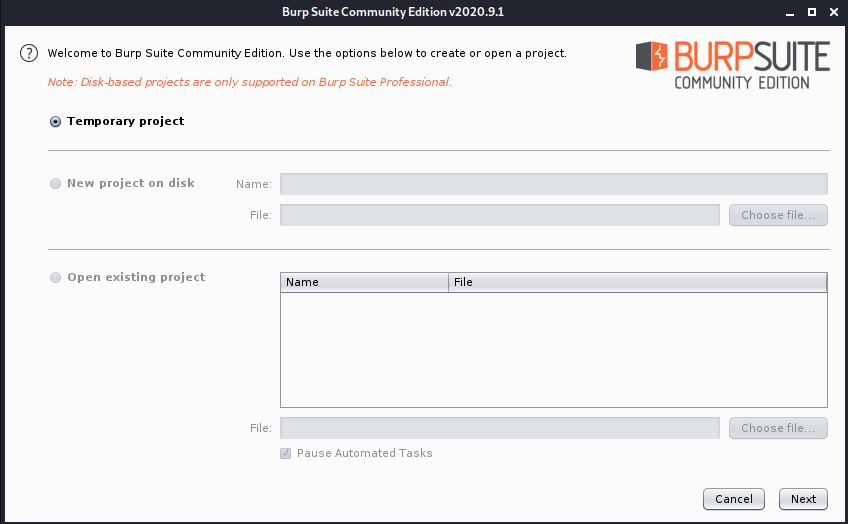

[Volver](../README.md)

# Coonfiguracion laboratorio

## Burpsuite

Burp Suite es una plataforma integrada para la realización de las pruebas de seguridad de las aplicaciones web. Sus diversas herramientas funcionan perfectamente juntas para apoyar todo el proceso de pruebas, de identificación y análisis de la superficie de ataque de una solicitud inicial, a través de la búsqueda y explotación de vulnerabilidades de seguridad.

Burp le da control total, lo que le permite combinar avanzadas técnicas manuales con la automatización de pruebas de seguridad alineadas con el estado de la técnica, para hacer su trabajo más rápido, más eficaz.

Burp Suite contiene los siguientes componentes principales:

- Proxy de interceptación tráfico de navegación (HTTP y HTTPs).
- Modulo de descubrimiento e indexación de contenido (Spider)
- Escáner de aplicaciones Web
- Herramientas de Fuzzing avanzadas
- Análisis de sesiones
- Soporte de potentes plugins (extensiones)
- Numerosas herramientas colaborativas

## Web-Security

The Web Application Hacker's Handbook

Web Security Academy es un centro de formación en línea gratuito para la seguridad de aplicaciones web. Incluye contenido del equipo de investigación interno de PortSwigger, académicos experimentados y nuestro fundador Dafydd Stuttard, autor de The Web Application Hacker's Handbook.

A diferencia de un libro de texto, la Academia se actualiza constantemente. También incluye laboratorios interactivos donde puede poner a prueba lo aprendido. Si desea mejorar sus conocimientos sobre piratería, o si desea convertirse en un cazarrecompensas de errores o pentester, está en el lugar correcto.

https://portswigger.net/web-security
https://portswigger.net/web-security/all-materials
https://portswigger.net/web-security/all-labs


http://bodgeit.herokuapp.com
https://owasp.org/www-project-webgoat/

## Ejecucion de burpsuite

```bash
java -Xmx2g burpsuite.jar
```

