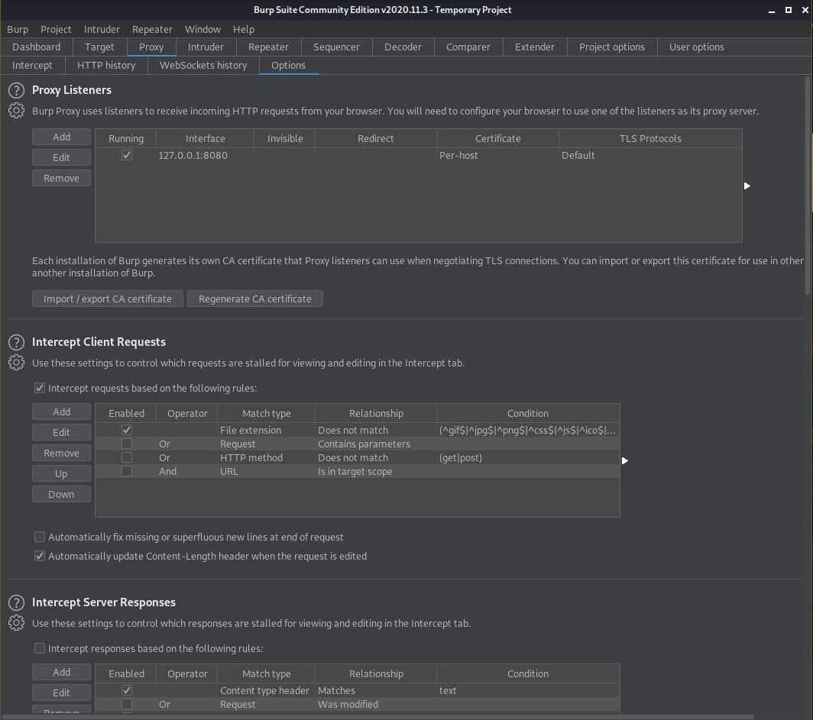
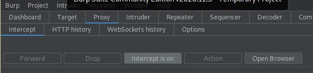
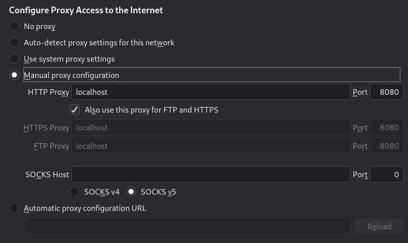
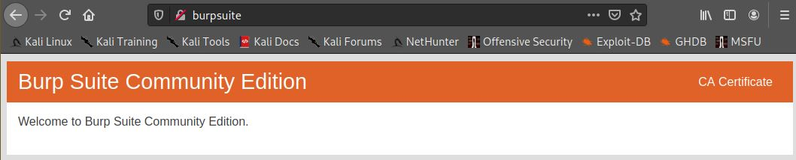
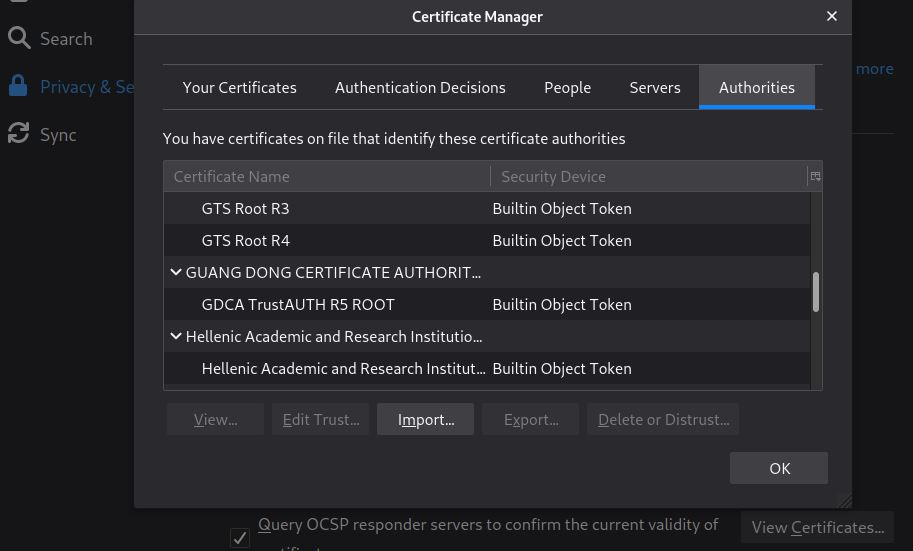
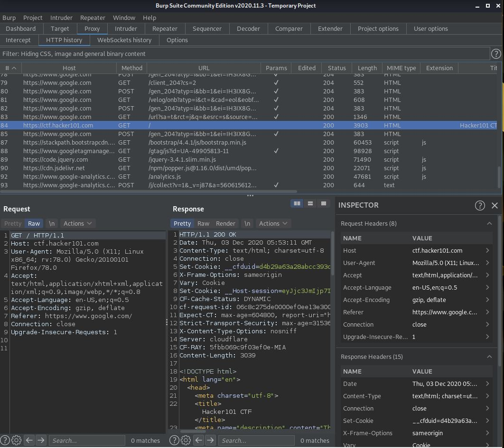

[Volver](../README.md)

# Certificado SSL en burpsuite

## Agregar certificado

verificar que el proxy se este ejecutando en el puerto indicado

verificar que el modo intercept este activado

Configurar proxy en firefox

Ingresar a la url http://burpsuite/ y descargar el certificado.

Importar certificado al navegador

Validar que funciona

